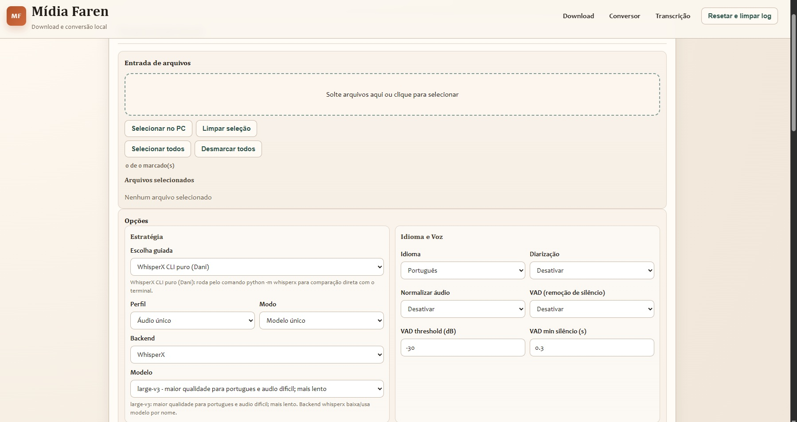

# Mídia Faren - Guia Completo de Instalação (Pacote ZIP / GitHub)

Este repositório foi preparado para rodar localmente no Windows **sem depender de Git**.

Você pode:
- baixar ZIP do projeto,
- descompactar,
- executar `executar.bat`.

## Ilustrações do projeto




## Áudio de exemplo incluído (para teste imediato)

Este pacote já inclui um áudio real de sessão para quem quiser validar o fluxo completo sem preparar arquivos próprios:

- Arquivo: [`Guia HTML (áudio de exemplo)`](https://farenravirar.github.io/midia-faren/#audio-exemplo)  
  Fallback local do pacote: `index.html#audio-exemplo`
- Contexto: one-shot no cenário de **The Witcher**
- Mesa: **3 jogadores**
- Sistema: **DND 5e 2024**

Use este arquivo para:
- testar transcrição com marcação de tempo e falantes,
- validar glossário e qualidade dos modelos,
- gerar material para o passo de resumo no NotebookLM.

---

## 1) O que este pacote contém

- `app.py`: servidor Flask da aplicação.
- `executar.bat`: instalador/validador automático + inicialização.
- `mfaren/`: backend principal (download, conversão, transcrição, filas, jobs).
- `static/` e `templates/`: frontend.
- `instalacao_de_resumo_de_sessao.html`: guia visual com fluxo de resumo no NotebookLM.
- `MODELOS_DOWNLOAD.txt`: links dos modelos + onde colocar cada arquivo.
- `SMOKE_TEST_10_MIN.md`: checklist rápido para validar instalação em ~10 minutos.
- `requirements.manual.txt`: referência de dependências para instalação manual.
- `tests/`: testes automatizados (opcional para quem só vai usar).

Estrutura de runtime incluída vazia:
- `data/uploads/`
- `data/transcribe_cache/`
- `downloads/`
- `logs/`

---

## 2) Requisitos obrigatórios

Instale estes itens antes da primeira execução:

1. Python 3.11+ (3.13 também funciona)
   - https://www.python.org/downloads/windows/
2. FFmpeg (build "full shared")
   - https://www.gyan.dev/ffmpeg/builds/
3. Microsoft Visual C++ Redistributable (x64)
   - https://learn.microsoft.com/en-us/cpp/windows/latest-supported-vc-redist

Recomendado para melhor desempenho:

4. Driver NVIDIA atualizado (se usar GPU)
   - https://www.nvidia.com/Download/index.aspx
5. CUDA Toolkit (opcional para validação manual da toolchain)
   - https://developer.nvidia.com/cuda-downloads

Observações:
- Internet é necessária na primeira execução (download de pacotes Python/modelos).
- Reserve espaço livre em disco (ideal: 15 GB+ para operação confortável).

---

## 3) Instalação do zero (sem Git)

1. Baixe o ZIP do projeto.
2. Descompacte em uma pasta local (ex.: `C:\midia-faren`).
3. Abra a pasta e execute `executar.bat`.
4. Aguarde os passos de instalação/validação.
5. O navegador abrirá em: `http://127.0.0.1:5000/`.

Se o navegador não abrir automático, acesse manualmente a URL acima.

---

## 3.1) Fluxo GitHub (clonar, commitar e publicar)

Repositório oficial:
- https://github.com/FarenRavirar/midia-faren/

### Clonar o repositório

```bat
git clone https://github.com/FarenRavirar/midia-faren.git
cd midia-faren
```

Se você quiser trabalhar só no pacote de instalação:

```bat
cd instalacao\midia-faren
```

### Commits e push (fluxo básico)

```bat
git status
git add .
git commit -m "chore: atualizacao da documentacao e instalacao"
git push origin main
```

### Baixar ZIP sem Git

No GitHub, clique em:
- `Code` -> `Download ZIP`

### Publicar ZIP em Releases (recomendado)

1. Criar tag e enviar:

```bat
git tag -a v1.0.0 -m "release v1.0.0"
git push origin v1.0.0
```

2. No GitHub:
   - `Releases` -> `Draft a new release`
   - selecione a tag `v1.0.0`
   - escreva título e notas
   - anexe o ZIP do pacote (`instalacao/midia-faren`).

3. Para gerar ZIP localmente (PowerShell):

```powershell
Compress-Archive -Path ".\instalacao\midia-faren\*" -DestinationPath ".\instalacao\midia-faren-v1.0.0.zip" -Force
```

---

## 4) O que o `executar.bat` faz

- Cria/reutiliza o venv local: `.venv_cuda`
- Instala/atualiza pacotes base:
  - `flask`, `requests`, `yt-dlp`
- Instala stack IA fixada (estável para este projeto):
  - `torch==2.8.0+cu128`
  - `torchaudio==2.8.0+cu128`
  - `faster-whisper==1.2.1`
  - `whisperx==3.8.0`
  - `ctranslate2==4.7.1`
- Remove `torchcodec` por instabilidade no Windows nesse stack.
- Valida imports e sobe o Flask.

### Flags úteis do `executar.bat`

- `--check`: só valida ambiente, sem reinstalar.
- `--setup-env`: força reinstalação das dependências.
- `--recreate-venv`: recria o venv do zero.
- `--ffmpeg-path-on`: injeta FFmpeg local no PATH da sessão.
- `--ffmpeg-path-auto`: injeta só se não houver FFmpeg no PATH.
- `--ffmpeg-path-off`: não injeta PATH (padrão).

Exemplo:

```bat
executar.bat --setup-env --recreate-venv --ffmpeg-path-auto
```

---

## 5) FFmpeg: como garantir detecção

A aplicação procura FFmpeg nesta ordem:

1. `tools\ffmpeg\bin\ffmpeg.exe`
2. `C:\tools\ffmpeg\ffmpeg-7.1.1-full_build-shared\bin\ffmpeg.exe`
3. `ffmpeg` no PATH

Para não ter erro:
- opção A: instalar FFmpeg e adicionar no PATH;
- opção B: colocar binário em `tools\ffmpeg\bin` dentro do projeto;
- opção C: usar `executar.bat --ffmpeg-path-auto`.

Teste rápido:

```bat
ffmpeg -version
```

---

## 6) GPU vs CPU (comportamento real)

- O projeto roda com e sem CUDA.
- Com CUDA disponível: transcrição muito mais rápida.
- Sem CUDA: funciona em modo CPU (mais lento).

Verificação rápida:

```bat
.venv_cuda\Scripts\python -c "import torch; print(torch.cuda.is_available(), torch.version.cuda)"
```

---

## 7) Backends de transcrição

Disponíveis na UI:
- `whisper_cpp`
- `faster_whisper` (recomendado padrão)
- `whisperx`

Recursos do pipeline:
- chunking com overlap
- checkpoint por chunk
- retomada/reprocessamento de chunk
- guardrails anti-loop
- glossário/contexto persistente

---

## 8) Modelos (qualidade x velocidade)

- `tiny`: muito rápido, qualidade baixa.
- `base`: rápido, qualidade baixa/média.
- `small`: equilíbrio para teste.
- `medium`: qualidade boa com prazo.
- `large-v3`: melhor qualidade, mais lento.
- `distil-large-v3`: quase qualidade do large-v3 com mais velocidade.

Links oficiais dos modelos:
- https://huggingface.co/openai/whisper-tiny
- https://huggingface.co/openai/whisper-base
- https://huggingface.co/openai/whisper-small
- https://huggingface.co/openai/whisper-medium
- https://huggingface.co/openai/whisper-large-v3
- https://huggingface.co/distil-whisper/distil-large-v3

Arquivo dedicado de modelos (links + destino + checklist):
- `MODELOS_DOWNLOAD.txt`

### Onde cada modelo fica

- `faster_whisper` / `whisperx`:
  - não precisa copiar manualmente;
  - baixa automaticamente na primeira execução;
  - cache padrão em `%USERPROFILE%\.cache\huggingface\hub`.

- `whisper_cpp`:
  - baixar arquivos `ggml-*.bin` manualmente;
  - copiar para `transcriber\models\`;
  - nomes dos arquivos devem permanecer exatamente iguais.

---

## 9) Importante sobre `whisper_cpp` neste pacote GitHub

Para manter o repositório leve e compatível com limites do GitHub:
- binários grandes e modelos `.bin` do `whisper_cpp` **não estão incluídos** neste pacote.

Impacto:
- `faster_whisper` e `whisperx` continuam prontos para uso;
- `whisper_cpp` pode exigir baixar binários/modelos separadamente se você quiser usar esse backend.

Se não quiser setup adicional, use:
- backend `faster_whisper` ou `whisperx`.

Se quiser usar `whisper_cpp`, siga exatamente:
1. Abra `MODELOS_DOWNLOAD.txt`.
2. Baixe os modelos `ggml-*.bin`.
3. Copie os arquivos para `transcriber\models\`.
4. Na UI, selecione backend `whisper_cpp` e o modelo correspondente.

---

## 10) Fluxo recomendado: Craig -> Transcrição estruturada -> NotebookLM

### Regra principal

Para resumo de sessão no NotebookLM, a fonte principal deve ser a **transcrição em texto** (TXT/SRT) com:
- timestamps corretos;
- separação por falantes/personagens (quando aplicável);
- ordem cronológica preservada.

O arquivo de áudio mixado (M4A) pode ser usado como fonte complementar, mas **não substitui** a transcrição estruturada para esse objetivo.

### Pipeline recomendado no projeto

1. Gere a transcrição completa no módulo **Transcrição**.
2. Confirme saída em `.txt` e `.srt` (com marcação temporal e falantes).
3. Revise trecho final para evitar cauda repetitiva/loop.
4. (Opcional) Gere M4A no módulo **Conversor > Mixagem**.
5. Acesse NotebookLM: https://notebooklm.google.com/
6. Crie notebook e envie primeiro o TXT/SRT.
7. Use o prompt de conto para gerar o resumo da sessão.

Guia visual e prompt:
- `instalacao_de_resumo_de_sessao.html`

### 10.1) Passo a passo no NotebookLM

1. Acesse https://notebooklm.google.com/
2. Crie um novo notebook.
3. Adicione a transcrição (`.txt` ou `.srt`) como fonte principal.
4. Aguarde indexação da fonte.
5. (Opcional) adicione o M4A como fonte complementar.
6. Cole o prompt (seção 10.2) no chat do NotebookLM.
7. Idioma: Português (Brasil).

### 10.2) Prompt pronto (modelo genérico)

```text
Gere um resumo da sessão de RPG baseada na transcrição "[nome da transcrição]" no cenário "[nome do cenário]".

Quero um texto em formato de conto narrado em primeira pessoa do plural ("nós"), como se um dos jogadores estivesse contando para amigos o que aconteceu.

Regras do resultado:
1) Não faça análise técnica da mesa.
2) Não foque em elogiar ou exaltar pessoas específicas.
3) Conte os acontecimentos da sessão com narrativa fluida e empolgante.

Estrutura esperada:
1) Abertura da sessão:
   - como nós chegamos;
   - contexto inicial do local;
   - quem eram os personagens presentes.

2) Desenvolvimento:
   - conflitos e tensões;
   - estratégias que nós tentamos;
   - decisões e indecisões;
   - reviravoltas, surpresas e consequências;
   - acontecimentos importantes em ordem clara.

3) Fechamento:
   - estado final do grupo;
   - perguntas em aberto;
   - gancho para continuação.

Diretriz de fidelidade:
- Use os nomes e fatos das fontes enviadas (transcrição com timestamps/falantes + notas de contexto), sem inventar fatos fora do material.
- Se algo estiver ambíguo, indique como possibilidade em vez de afirmar com certeza.

Final obrigatório (adapte ao contexto):
"Vamos ver aonde essa trama vai nos levar na próxima sessão."
```

### 10.3) Bloco de notas de contexto (para colar no NotebookLM)

```text
[NOTAS DE CONTEXTO DA SESSAO]

Nome do audio: [nome do audio]
Nome do cenario: [nome do cenario]
Sistema: [sistema de RPG]
Resumo do contexto inicial: [contexto inicial da sessao]

Personagens de jogadores:
- Jogador: [nome do jogador 1]
  Personagem: [nome do personagem 1]
  Conceito: [raca/classe/profissao]
  Vinculo ou origem: [faccao/cidade/clan/grupo]
  Motivacao atual: [objetivo na sessao]

- Jogador: [nome do jogador 2]
  Personagem: [nome do personagem 2]
  Conceito: [raca/classe/profissao]
  Vinculo ou origem: [faccao/cidade/clan/grupo]
  Motivacao atual: [objetivo na sessao]

NPCs importantes:
- NPC: [nome do NPC 1]
  Papel na historia: [funcao]
  Relacao com o grupo: [como influencia o grupo]

- NPC: [nome do NPC 2]
  Papel na historia: [funcao]
  Relacao com o grupo: [como influencia o grupo]

Termos e nomes que nao devem ser corrigidos:
- [termo 1]
- [termo 2]
- [local 1]

Observacoes de pronuncia ou escrita:
- [nome dificil 1] -> [forma correta]
- [nome dificil 2] -> [forma correta]
```

---

## 11) Verificações pós-instalação

```bat
.venv_cuda\Scripts\python -c "import flask,requests,yt_dlp; print('core_ok')"
.venv_cuda\Scripts\python -c "import torch; print(torch.__version__, torch.cuda.is_available(), torch.version.cuda)"
.venv_cuda\Scripts\python -c "import importlib.metadata as md; print(md.version('whisperx'), md.version('faster-whisper'), md.version('ctranslate2'))"
```

---

## 12) Troubleshooting rápido

### `ffmpeg` não encontrado
- Reinstale FFmpeg full shared.
- Valide `ffmpeg -version`.
- Use `executar.bat --ffmpeg-path-auto`.

### Erro de dependência Python
- Rode:

```bat
executar.bat --setup-env --recreate-venv
```

### Transcrição lenta
- Use modelo menor (`small`/`medium`).
- Use backend `faster_whisper`.
- Verifique se CUDA está ativo.

### Loop/repetição no final
- Ajuste chunk/overlap.
- Revise glossário e contexto.
- Use reprocessamento de chunk.

---

## 13) Publicação no GitHub

Esta pasta já está preparada para publicação:
- `.gitignore` configurado para ignorar dados locais/caches.
- sem caminhos pessoais hardcoded.
- sem venv embutido.
- sem binários gigantes de `whisper_cpp`.

---

## 14) Smoke test de 10 minutos

Use o checklist completo em:
- `SMOKE_TEST_10_MIN.md`

Resumo rápido (aprovação):
1. App sobe e UI abre.
2. Conversão curta termina com sucesso.
3. Transcrição curta gera `.txt` + `.srt`.
4. Cancelamento funciona.
5. Sem erro crítico persistente no fim de `logs/app.log`.

---

## 15) Créditos

Desenvolvido por **Paulo "Faren" Lima** - Artifício RPG
- https://artificiorpg.com/
